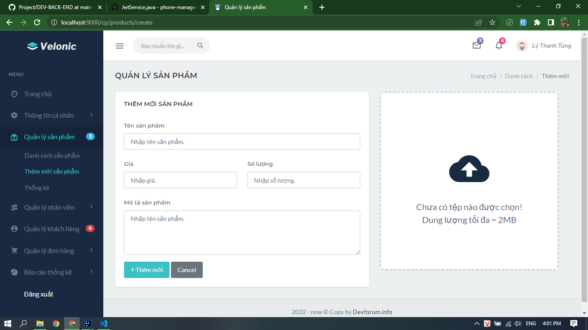

PHONE STORE MANAGER: QUẢN LÝ CỬA HÀNG ĐIỆN THOẠI

1. Kiến thức & Công nghệ áp dụng: Spring boot, API, Java, HTML, CSS, JavaScript, GitHub, Bootstrap,..

2. Tổng hợp chức năng:
- Đăng nhập/ Đăng ký.
- Quản lý sản phẩm: Thêm, sửa, xóa(mềm), xem thông tin chi tiết...
- Quản lý nhân viên: Thêm, sửa, xóa(mềm),  xem thông tin chi tiết...
- Quản lý khách hàng: Xem thông tin chi tiết, xóa(mềm),...
- Phân quyền.
- ...

3. Một số hình ảnh
- Đăng nhập

- Đăng ký

- Giao diện admin

- Thêm mới sản phẩm (admin)

- Giao diện user (Không có chức năng thêm, sửa, xóa)

- Giao diện trang bán hàng (Khách hàng)

